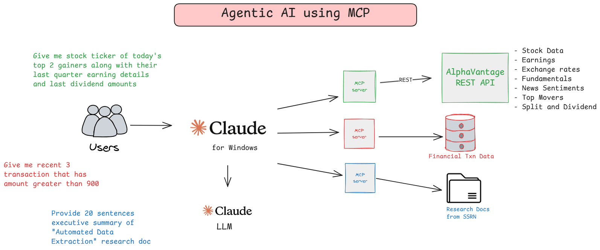

# What?




Sample application showing Agentic AI using MCP Server connecting to REST API, PostgreSQL Database and Document Storage

# Setup
## UV Installation and Setup

1. **Install UV**  
    To install UV, run the following command:
    ```bash
    pip install uv
    ```

2. **Verify Installation**  
    Confirm that UV is installed by running:
    ```bash
    uv --version
    ```

## Using `pyproject.toml`
### Setting Up a Virtual Environment and Installing Dependencies

1. **Create a Virtual Environment**  
    Run the following command to create a virtual environment:
    ```bash
    python -m venv venv
    ```

2. **Activate the Virtual Environment**  
    - On Windows:
      ```bash
      venv\Scripts\activate
      ```
    - On macOS/Linux:
      ```bash
      source venv/bin/activate
      ```

3. **Install Dependencies from `pyproject.toml`**  
    Use `pip` to install dependencies specified in the `pyproject.toml` file:
    ```bash
    pip install .
    ```

4. **Verify Installation**  
    Ensure all dependencies are installed correctly:
    ```bash
    pip list
    ```
## Populate Financial Txn Data 
1. **Run the Script to Populate Data**  
    Execute the following command to populate sample financial transaction data:  
    ```bash
    python util/populate_data.py
    ```

## Configure MCP Client - Claude for Windows 
1. **Locate the Sample Configuration File**  
    Use the provided `config/sample_claude_desktop_config.json` file as a template.

2. **Copy the Configuration File**  
    Place the file in the following directory:  
    ```plaintext
    ~\AppData\Roaming\Claude
    ```

3. **Rename the File**  
    Rename the file to `claude_desktop_config.json`.

4. **Update Configuration Details**  
    - Open the `claude_desktop_config.json` file in a text editor.
    - Update the **Alpha Vantage API Key** with your key.
    - Update the **Database Connection Details** with the appropriate credentials and connection string.

## Restart Claude Desktop 

Restart Claude Desktop, you might have to kill tasks from Task manager. Note that once you restart it, 

1. You should be able to see number of tools along with hammer icon. 
2. This will start python program for each tool in background. 